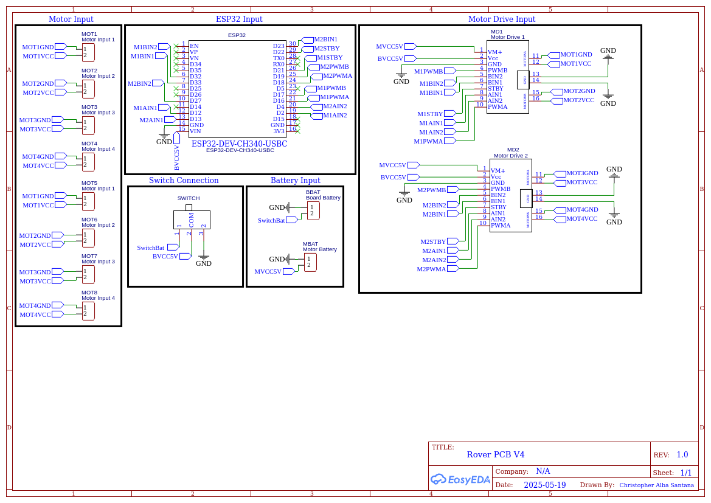
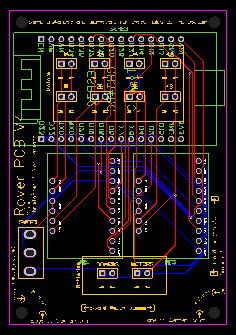

[PICTURE]

# Introduction

The purpose of this repository is to provide access to an open-source platform that I have created and developed for students over the last few years as a means of expanding their understanding of physics concepts by applying physics concepts to engineering challenges. This engineering challenge entails the create of a rover - a four- to eight-wheeled vehicle - using an ESP32 microcontroller on a custom PCB.

The engineering challenge has changed over the years, but most recently it has resulted in the development of the companion repository to this repository - the rover challenges arena. Students try to complete up to 10 different challenges with the use of a rover. The present repository covers the construction and coding of the rover.

# Rover Materials

The materials used for this project are broken down into the following components.

## Custom-PCB

[PICTURE]

This custom PCB is designed for an ESP32 to connect to two small motor drivers. It has pins for up to eight motors. However, because each motor driver can only control two motors, this is achieved by making parallel connections to each of the exisiting connections. This means that only four motors can be individually controlled.

This PCB was created using [EasyEDA](https://easyeda.com/). To order a copy of this PCB, uploead the Gerber file from the PCB folder and upload it to [JLCPCB](https://jlcpcb.com/?href=easyeda-home), which is one of many websites that can manufacture PCBs for consumers. They are generally really cheap. As an example, a batch of 50 PCBs costs $19. The only real expensive part is the shipping, usually around $17-50.

The PCB schematic is on the left and the PCB layout is on the right in the images below.

  
  

## Microcontroller, Motors, and Motor Drivers

The following materials need to be purchased for this rover (links included):

* [USB-C ESP32 (X1, $8.99 ea.)](https://www.amazon.com/AITRIP-ESP-WROOM-32-Development-Microcontroller-Integrated/dp/B0DF2YJSHN/ref=sr_1_3?crid=1G6IDOYNKPKX9&dib=eyJ2IjoiMSJ9.J8fl2PuZsBFTQRqqz9O9mLtmR5c3g4T6QqdGo-D0eTjT6x-RNRspTE-T1cENww24dOzuOXNMWdfDVSyXLg11Bf9geRDMJQTGeN8fDzUZQdUuu6ql33jUCzh54aLePB23ZYlcQnI6kKamfVrkVmBWImiDyPM2_cfJRQ31eAQTGoVGCAZvd5FDOsKMtfXPDIBeboR9r5_mAR9PJ2iZAl1XFMpgxN3lRmXGAhl4d1pkhEw.R_NzTn628-SylaJJRwnYczlZxkceZnzVgDT5ZIbxqGE&dib_tag=se&keywords=esp32%2Busb%2Bc&qid=1747615119&sprefix=esp32%2Busb%2Bc%2Caps%2C127&sr=8-3&th=1)
* [Motor Driver (X2, $6.95 ea.)](https://www.adafruit.com/product/2448)
* [Batteries (X2, $19.99 total)](https://www.amazon.com/dp/B0C5CDZ7HS?ref_=ppx_hzsearch_conn_dt_b_fed_asin_title_3)
* [Battery adapter cables (X2, $1.17 ea.)](https://www.amazon.com/dp/B08SC3D3SQ?ref_=ppx_hzsearch_conn_dt_b_fed_asin_title_1&th=1)
* [DC Motors (X4-X8, $3.50 ea.)](https://www.adafruit.com/product/2941)
* [Wheels (X4-X8, $2.50 ea.)](https://www.adafruit.com/product/2744)
* [Male Header Pins (X16, ~$0.20 total)](https://www.amazon.com/MCIGICM-Header-2-45mm-Arduino-Connector/dp/B07PKKY8BX/ref=sr_1_3?crid=1UOTCLVLP8NBF&dib=eyJ2IjoiMSJ9.3vFjmsH10W3-0I49M7i2SLer6N2w76n3suAL41lNyWbCktqeX2xUwJKGOw1Unq-mAp24IQL2WQ-Ev7Umi65YURue2SRQPZGjTOn-chwyhK-M_IjeCaW5rokSMnyMAVVnZTc5CzgG8dEONU-uutB7UxnSnLH0U2Croee-BUiI-JDEPxRCRiiMCBSRJgNAdIBv6GiGNRgSYq-3P6zK5nOuW5kb43uDa-oWIACeoFh99JM.nKbcZqvC_hNR6ES6f7s5o9FuPlfrFeEAsgNfd5lOjas&dib_tag=se&keywords=male+header+pin&qid=1747615696&sprefix=male+header+pin%2Caps%2C160&sr=8-3)
* Female JST Connectors
* M3 x 10mm Hex Screw
* M3 Nut

Based on XYZ ...

# Rover Body

[PICTURE]

The rover body needs to be able to hold the most critical parts of the rover, specifically the PCB and batteries. It is also usually the largest single piece of the rover. For this reason, lasercutting is particularly useful. You can not only make large parts without warping, as would occur with 3D printing such a large piece, but you can also make them fast, allowing room for rapid prototyping and fixing of mistakes (because things seldom go right the first time around).

## OnShape

To make the body and other parts of the rover, I use [OnShape](https://cad.onshape.com/) and recommend that my students do the same. This is a free online CAD tool, available on all devices and can run even on the most limited of hardware machines.

### OnShape Tutorial

I ask my students to follow an [OnShape Tutorial](https://learn.onshape.com/courses/unit-2-designing-a-skateboard) first, creating a skateboard to familiarize themselves with the tools of OnShape. Most useful are the sketch, extrude, mirror, and dimension tools.

After students have become familiar with OnShape, it is then recommended that they create their own OnShape document and share it out with their group members. While one person will be primarily taking the responsibility of the document, they should all be involved with determining measurements and making design decisions. There will also be days where the lead the designer may be out, so others need to step in their place to continue progress.

### OnShape CAD Model

Below you will see an example of what a rover could look like. This is a very basic design and students can - and should - deviate from it to suit their needs.

[PICTURE]

Most notable about this design are the following features:

* **Motor Wire Holes**: On the base itself, there are two large holes that are meant to be used for wire passthrough. This should make it easier and prevent the need for wire extenders.
* **Vertical PCB**: The PCB is placed vertically such that accessing the USB-C port is easier. Additionally, this makes it so that the overall footprint of the base is smaller.
* **Four Motors**: I decided on four motors for simplicity. Having a few additional motors may have been helpful to increase friction for challenges like Challenge 6: Welcome to Seattle, but I decided against it. Should students wish to attempt this challenge, it may be wise to increase the number of motors/wheels.

### Videos for Support

Below you will find videos pertaining to each section of the base design and how they were created. It may be helpful to view them, but then deviate as needed.

**Base**

[VIDEO]

**PCB Holder**

[VIDEO]

**Battery Holders**

[VIDEO]

**Motor Mounts**

[VIDEO]

## Lasercutting and 3D Printing

Most of the rover will be - or at least should be - lasercut. This will make prototyping easier. Out of the previously demonstrated parts, the base, PCB holder, and battery holders components will be lasercut. Motor mounts, due to both their small size and irregular shape, are best 3D printed. Below you will find specifications of the lasercutter and 3D printer used.

### Lasercutter

### 3D Printer

## Assembly

Once all parts have been lasercut and 3D printed, it is time for assembly. I highly suggest starting off with hot gluing all parts that need to be hot glued and waiting for a bit for them to dry off. After doing this, it is recommended to assemble in the following order:

* Place and screw the PCB. Make sure the ESP32 and motor drivers are on it.
* Place the DC motors inside the motor mounts, being very careful with their cables, and then screw the motor mounts onto the flat lasercut base.
* Screw the wheels onto the DC motors.
* Connect the motors in the appropriate locations.
* Connect the battery adapter cables.
* Connect the batteries to test that all components work. Remove once you've confirmed all components seem to be working OK. Report any issues.

# Programming

## Thonny

## Programming Basics

# Tips

Since I have been doing this for a while, there are a lot of issues I've learned how to troubleshoot.
